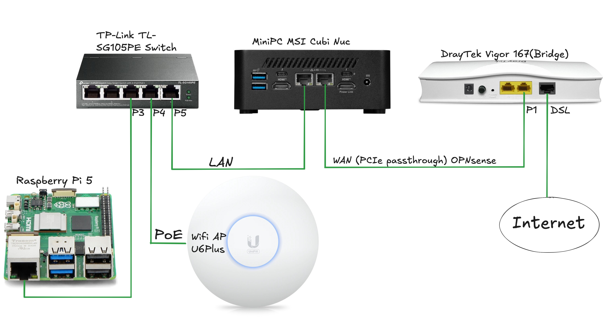
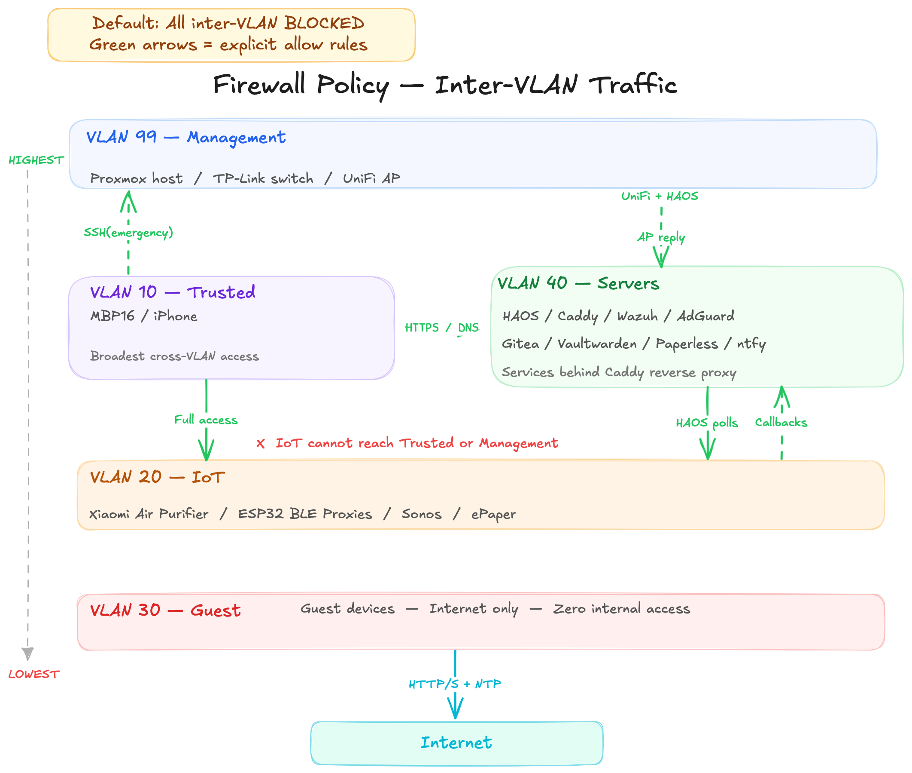

# kuzlab.dev — Home Infrastructure Lab

A self-hosted infrastructure environment built on Proxmox virtualization, OPNsense firewalling, and five-VLAN network segmentation — designed, documented, and operated as a working lab for learning networking, security operations, and systems administration.

---

## Architecture

Traffic enters through a DrayTek Vigor 167 modem in bridge mode, passing raw WAN directly to an OPNsense VM running on Proxmox via PCIe NIC passthrough. OPNsense handles all routing, firewalling, NAT, and VLAN assignment. A managed TP-Link switch trunks tagged traffic to five VLANs, and a UniFi U6+ access point maps SSIDs to the appropriate VLANs for wireless clients.



---

## Network Design

Inter-VLAN traffic is denied by default (RFC1918 block on every interface). Green arrows below represent explicit allow rules configured in OPNsense. Management access to Proxmox, OPNsense, and the switch is restricted to Tailscale mesh VPN — identity-based device authentication rather than network-based. SSH from Trusted to Proxmox is retained as an emergency fallback only.



### VLANs

| VLAN | ID | Subnet | Purpose | Trust level |
|------|----|--------|---------|-------------|
| Management | 99 | 192.168.99.0/24 | Proxmox, OPNsense, switch, AP | Highest — Tailscale access only |
| Servers | 40 | 192.168.40.0/24 | All VMs and containers | High — accepts controlled inbound |
| Trusted | 10 | 192.168.10.0/24 | Personal devices | Medium — can reach servers via Caddy |
| IoT | 20 | 192.168.20.0/24 | Smart home devices | Restricted — isolated from all other VLANs |
| Guest | 30 | 192.168.30.0/24 | Guest Wi-Fi | Lowest — internet only |

### Firewall Policy

All inter-VLAN traffic is denied by default. Explicit allow rules are defined per source/destination pair:

- **Trusted → Servers:** Caddy HTTPS, AdGuard DNS, Wazuh agent ports
- **Trusted → IoT:** Full access for device admin, AirPlay, Sonos
- **Trusted → Management:** SSH to Proxmox only (emergency fallback)
- **IoT → Servers:** Narrow callbacks to HAOS only (Sonos, Music Assistant, ePaper)
- **Servers (HAOS) → IoT:** Device polling (ESPHome, miio, Shelly, Sonos)
- **Servers → Management:** UniFi controller to AP, HAOS to Proxmox (UPS shutdown via SSH, Samba)
- **Management → Servers:** AP firmware updates to UniFi controller
- **IoT → Trusted / Management:** Blocked
- **Guest → everything internal:** Blocked — internet only

### DNS

Client devices and servers use separate DNS paths:

```
Clients (Trusted / IoT / Guest) → AdGuard Home (filtering) → Unbound (recursive) → Root servers
Servers / Management            → Unbound (recursive) → Root servers
```

Servers bypass AdGuard intentionally — infrastructure DNS should not depend on a filtering service that could crash or block a legitimate domain. Client filtering stays in place. If AdGuard goes down, only client devices lose DNS; servers continue resolving.

No fallback DNS is configured for clients — if AdGuard goes down, DNS fails visibly rather than silently bypassing filtering.

Wildcard DNS (`*.kuzlab.dev`) resolves via Cloudflare to the Caddy reverse proxy, which routes to internal services with valid TLS certificates issued automatically through DNS-01 challenge.

### Access Model

| Scenario | Path | Auth |
|----------|------|------|
| Service access (local) | Caddy via *.kuzlab.dev | WiFi + service login |
| Service access (remote) | Tailscale → Caddy or direct IP | Tailscale device key + service login |
| Management (Proxmox, OPNsense, switch) | Tailscale → direct IP | Tailscale device key + service login |
| Proxmox daily use | Caddy via proxmox.kuzlab.dev | Passkeys (WebAuthn) |
| Emergency | SSH from Trusted → Proxmox | SSH key |

---

## Services

### Proxmox Guest Inventory

| ID | Name | Type | VLAN | Role | IP |
|----|------|------|------|------|----|
| VM 100 | Home Assistant OS | VM | 40 | Home automation, BLE tracking, dashboards | 192.168.40.10 |
| VM 108 | OPNsense | VM | 99 / WAN | Firewall, router, VLAN routing, NAT, Unbound | 192.168.99.1 |
| VM 110 | Wazuh | VM | 40 | SIEM — vulnerability detection, log collection | 192.168.40.19 |
| VM 111 | UniFi OS Server | VM | 40 | Network controller for UniFi AP | 192.168.40.18 |
| CT 101 | Gitea | LXC | 40 | Self-hosted Git (also Obsidian vault sync) | 192.168.40.14 |
| CT 102 | AdGuard Home | LXC | 40 | Network-wide DNS filtering | 192.168.40.11 |
| CT 103 | Paperless-ngx | LXC | 40 | Document management | 192.168.40.15 |
| CT 104 | Node-RED | LXC | 40 | Automation flows | 192.168.40.16 |
| CT 105 | Actual Budget | LXC | 40 | Personal finance tracking | 192.168.40.17 |
| CT 107 | Vaultwarden | LXC | 40 | Password manager (Bitwarden-compatible) | 192.168.40.13 |
| CT 109 | Caddy | LXC | 40 | Reverse proxy — Docker with caddy-cloudflare image | 192.168.40.12 |
| CT 114 | Uptime Kuma | LXC | 40 | Service monitoring and status page | 192.168.40.22 |
| CT 113 | Homepage | LXC | 40 | Dashboard | 192.168.40.21 |
| CT 112 | ntfy | LXC | 40 | Push notifications | 192.168.40.20 |

### Service Dependencies

The diagram below shows how clients reach services through the Caddy reverse proxy, how the DNS chain is split between clients and servers, and how Tailscale provides management access bypassing the firewall entirely.


### Reverse Proxy

Caddy runs in Docker (using the [`caddy-cloudflare`](https://github.com/caddy-builds/caddy-cloudflare) image) and handles TLS certificate automation for all `*.kuzlab.dev` subdomains via Cloudflare DNS-01 challenge. Previously ran as a Debian package — migrated to Docker after a system upgrade broke the Cloudflare DNS plugin. The migration included API token rotation, zero-downtime container switchover, and systemd service cleanup.

### Remote Access

Tailscale runs on the Proxmox host with advertised routes for all VLANs and a global DNS override pointing to AdGuard. This provides full remote access without exposing any services to the public internet. Tailscale also serves as the primary management access path — Proxmox, OPNsense, and switch UIs are accessible only through the Tailscale tunnel, not directly from the WiFi network.

---

## Security and Monitoring

### Wazuh SIEM

Wazuh is deployed as a dedicated VM with agents installed across all VMs and LXCs and additionally on personal macbook. Vulnerability detection is enabled and producing real CVE alerts.

**What the SIEM surfaces:**
- Vulnerability scans across all Debian-based guests
- Real-time log collection and correlation
- Security event alerting

**Triage examples from production:**
- **telnetd CVE** — Flagged as critical. Assessed and dismissed: telnetd is not installed or running on any guest. No action needed.
- **libarchive heap overflow** — Affected the Proxmox host. Responded with a full system upgrade on the node, verified post-upgrade health across all guests.
- **OpenSSL RCE (CVE-2025-15467, CVSS 8.8)** — Detected by Wazuh across multiple agents. Patched via `apt upgrade openssl libssl3`, restarted affected services (Caddy, Wazuh agents), verified SSL certificates remained functional. Zero downtime.

The Wazuh dashboard is accessible at `wazuh.kuzlab.dev` via the Caddy reverse proxy.

---

## Hardware

### Main Node — MSI Cubi NUC 1MG

| Component | Spec |
|-----------|------|
| CPU | Intel i5-120U |
| RAM | 40 GB DDR5-5200 (16 + 24 GB) |
| NVMe | 1x 512 GB |
| SSD | 1x 1 TB |
| NIC | 2x 2.5 GbE (1 passed through to OPNsense) |

### Backup Node *(planned)*

Raspberry Pi 5 — 8 GB RAM. Intended as a secondary node for backup DNS (AdGuard replica), Tailscale failover, and independent monitoring (Uptime Kuma).

### Network Gear

| Device | Model | Role |
|--------|-------|------|
| Modem | DrayTek Vigor 167 | Bridge mode — raw WAN passthrough |
| Switch | TP-Link TL-SG105PE | Managed, PoE, VLAN trunking |
| WiFi AP | UniFi U6+ | Wi-Fi 6, three SSIDs (Trusted, IoT, Guest) |
| UPS | Eaton Ellipse 650 Pro | Power protection for full stack |

---

## Software

- **Hypervisor:** Proxmox VE 9.1.7
- **Guest OS:** Debian 12 / 13 (VMs and LXCs)
- **Provisioning:** Manual setup + [community scripts](https://community-scripts.github.io/ProxmoxVE/) for some containers

---

## Roadmap

- Finish **Cisco NetAcad Network Technician** path (~35 hours remaining)
- **CompTIA Security+ (SY0-701)** — target Aug/Sep 2026
- Firewall rules rework — granular IP-to-IP rules across all five VLANs
- Second Proxmox node (Raspberry Pi 5) for backup DNS and monitoring
- Additional services: Immich, Stirling-PDF
- DIY Siedle intercom smart integration (ESP32/ESPHome)

---

## About

This lab is part of an active career transition into IT — targeting SOC Analyst or infrastructure support roles. I'm a Polish citizen based in Germany, planning to relocate to Wroclaw, Poland within the next year. Languages: Russian (native), Polish (C1), English (professional working proficiency).

The infrastructure documented here is real, running 24/7, and serves as both a daily-use environment and a learning platform. Everything was built from scratch over the past year.

- **LinkedIn:** [kuzin-viacheslav](https://linkedin.com/in/kuzin-viacheslav)
