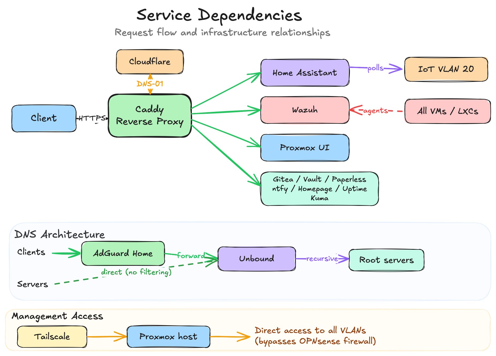

# kuzlab.dev — Home Infrastructure Lab

A self-hosted infrastructure environment built on Proxmox, OPNsense, and five-VLAN network segmentation — designed and operated as a real working lab for networking, security operations, and systems administration.

> **At a glance:** Two Proxmox hosts · five VLANs · OPNsense firewall · 13 services · Wazuh SIEM · Caddy reverse proxy · Tailscale remote access · UPS with automated shutdown · off-site backups

[Architecture](#architecture) · [Network](#network-design) · [Services](#services) · [Security](#security-and-monitoring) · [Backups](#backups) · [Hardware](#hardware) · [Roadmap](#roadmap)

---

## Architecture

Traffic enters through a DrayTek Vigor 167 modem in bridge mode, passing raw PPPoE to OPNsense running as a VM on a dedicated ZimaBoard 2. OPNsense handles routing, firewalling, NAT, DHCP, and VLAN assignment. Tailscale runs on OPNsense via the os-tailscale plugin, advertising all VLANs — so remote access still works even if the main services host goes down.

A UniFi USW-Lite-8-PoE switch distributes tagged traffic. A UniFi U7 Lite AP maps three SSIDs to Trusted, IoT, and Guest VLANs.

An MSI Cubi NUC runs all services on Proxmox VE as VMs and LXCs.


<details>
<summary>Switch port mapping</summary>

| Port | Device | Mode | PoE | Notes |
|------|--------|------|-----|-------|
| 1 | U7 Lite AP | Uplink | PoE+ | Servers native, tagged 10/20/30/99 |
| 2 | Empty | — | PoE+ | Reserved |
| 3 | Break-glass | Edge | — | VLAN 99 only, physical recovery access |
| 4 | SLZB-MR5U | Edge | PoE+ | Zigbee/Thread coordinator, VLAN 40 |
| 5 | Wired fallback | Edge | — | Trusted (10), laptop failsafe when WiFi is down |
| 6 | Reserved | — | — | Future Raspberry Pi 5 |
| 7 | MSI Cubi NUC | Uplink | — | Trunk: VLANs 10/40/99 |
| 8 | ZimaBoard 2 | Uplink | — | LAN trunk to OPNsense, all VLANs |

</details>

### Power and UPS

Everything is on an Eaton Ellipse PRO 650 UPS. Cubi is the NUT master, ZimaBoard is a network slave. On low battery, ZimaBoard shuts down first (takes the network with it), then Cubi drains all VMs in tiered order before the UPS cuts power. Recovery is fully automatic — tested end-to-end.

An Eve Energy smart plug on the DrayTek modem allows HAOS to power-cycle it automatically when the WAN watchdog detects a failure that software recovery can't fix.

[↑ top](#kuzlabdev--home-infrastructure-lab)

---

## Network Design

Inter-VLAN traffic is denied by default (RFC1918 block on every interface). All firewall rules use named aliases — no raw IPs anywhere.


### VLANs

| VLAN | ID | Subnet | Purpose |
|------|----|--------|---------|
| Management | 99 | 192.168.99.0/24 | Proxmox hosts, OPNsense, switch, AP |
| Servers | 40 | 192.168.40.0/24 | All VMs and containers |
| Trusted | 10 | 192.168.10.0/24 | Personal devices |
| IoT | 20 | 192.168.20.0/24 | Smart home devices |
| Guest | 30 | 192.168.30.0/24 | Guest WiFi — internet only |

### Firewall Policy

- **Trusted → Servers:** Caddy HTTPS, AdGuard DNS, Wazuh agent, HAOS
- **Trusted → IoT:** Full access for device admin, AirPlay, Sonos
- **Trusted → Management:** SSH and WebGUI to Proxmox/OPNsense (MacBook only, for recovery)
- **IoT → Servers:** Narrow callbacks to HAOS only (Sonos, Music Assistant, ESPHome)
- **Servers (HAOS) → IoT:** Device polling (ESPHome, miio, Shelly, Sonos)
- **Servers → Management:** UniFi controller, Caddy→Proxmox reverse proxy, monitoring, HAOS→Proxmox (Samba, NUT, sensors)
- **Management → Servers:** AP→UniFi controller, Proxmox→ntfy webhooks, Proxmox→HAOS CPU temp sensors
- **IoT → Trusted / Management:** Blocked
- **Guest → everything internal:** Blocked

Full ruleset: [firewall-rules.csv](OPNsense/firewall-rules.csv)

### DNS

```
Clients (Trusted / IoT / Guest) → AdGuard Home (filtering) → Unbound (recursive) → Root servers
Servers / Management            → Unbound (recursive) → Root servers
```

Servers bypass AdGuard on purpose — infrastructure DNS shouldn't depend on a filtering service. If AdGuard goes down, only client devices lose DNS; servers keep resolving.

No fallback DNS for clients — if AdGuard goes down, DNS fails visibly rather than silently bypassing filtering.

`*.kuzlab.dev` resolves via Cloudflare to Caddy, which handles TLS automatically through DNS-01 challenge.

### Access Model

Daily use goes through Caddy reverse proxy. Remote access uses Tailscale. Infrastructure management addresses are restricted — only the MacBook has direct firewall rules to reach Proxmox and OPNsense for local recovery. A dedicated VLAN 99 switch port provides physical break-glass access when routing is down.

| Scenario | Path |
|----------|------|
| Daily service access | Caddy via \*.kuzlab.dev |
| Remote access | Tailscale → Caddy or direct IP |
| Proxmox daily use | Caddy via cubi.kuzlab.dev / zima.kuzlab.dev |
| Local recovery | MacBook → direct Proxmox/OPNsense IP (firewall rule) |
| Emergency SSH | MacBook → Proxmox Cubi (bastion) |
| Break-glass | Cable to VLAN 99 switch port, static IP, no routing needed |

Each layer removes a dependency — from Tailscale (needs WAN + OPNsense + Tailscale) down to the break-glass port (needs only the switch powered).

[↑ top](#kuzlabdev--home-infrastructure-lab)

---

## Services

### Proxmox Guest Inventory

| ID | Name | Type | Role | IP |
|----|------|------|------|----|
| VM 202 | Home Assistant OS | VM | Home automation, dashboards | 192.168.40.10 |
| VM 200 | Wazuh | VM | SIEM — CVE detection, log collection (Ubuntu 24.04.4 LTS) | 192.168.40.19 |
| VM 201 | UniFi OS Server | VM | Network controller for AP and switch | 192.168.40.18 |
| CT 101 | Gitea | LXC | Self-hosted Git | 192.168.40.14 |
| CT 102 | AdGuard Home | LXC | Network-wide DNS filtering | 192.168.40.11 |
| CT 103 | Paperless-ngx | LXC | Document management | 192.168.40.15 |
| CT 104 | Node-RED | LXC | Automation flows | 192.168.40.16 |
| CT 105 | Actual Budget | LXC | Personal finance tracking | 192.168.40.17 |
| CT 107 | Vaultwarden | LXC | Password manager | 192.168.40.13 |
| CT 109 | Caddy | LXC | Reverse proxy (Docker, caddy-cloudflare) | 192.168.40.12 |
| CT 112 | ntfy | LXC | Push notifications | 192.168.40.20 |
| CT 113 | Homepage | LXC | Dashboard | 192.168.40.21 |
| CT 114 | Uptime Kuma | LXC | Service monitoring | 192.168.40.22 |

### Service Dependencies



### Reverse Proxy

Caddy runs in Docker (using [`caddy-cloudflare`](https://github.com/caddy-builds/caddy-cloudflare)) and handles TLS for all `*.kuzlab.dev` subdomains via Cloudflare DNS-01. Previously ran as a Debian package — migrated to Docker after a system upgrade broke the Cloudflare DNS plugin.

### Remote Access

Tailscale runs on OPNsense via the os-tailscale plugin with advertised routes for all VLANs. Full remote access without exposing anything to the public internet. Not required for local administration — daily use goes through Caddy, recovery uses direct firewall rules.

[↑ top](#kuzlabdev--home-infrastructure-lab)

---

## Security and Monitoring

### Wazuh SIEM

Wazuh runs as a dedicated VM with agents across the Proxmox hosts, OPNsense, supported VMs and LXCs, and my MacBook. Alerts go to ntfy via Dashboard Alerting monitors, plus a daily digest with CVE counts and top noisy rules.

**What it catches:**
- Vulnerability scans across all guests
- Real-time log collection
- Security event alerting by severity

**Some real cases:**
- **OpenSSL RCE (CVE-2025-15467, CVSS 8.8)** — Detected across multiple agents. Patched, restarted affected services, verified TLS still working. No downtime.
- **120+ critical CVEs from kernel 6.8** — Resolved by upgrading to kernel 6.17.
- **UniFi OS CVE flood** — Debian 12 base had unfixable CVEs. Rebuilt on clean Debian 13, brought CVE count to near zero.
- **rclone CVE-2026-41179** — Detected and patched.
- **telnetd CVE** — Flagged as critical. Dismissed after verifying telnetd isn't installed anywhere.

### Firewall Rules

All OPNsense rules use named aliases — zero raw IPs. The ruleset is exported, auto-sorted by a Git pre-commit hook, and published as a CSV. Raw OPNsense exports are gitignored.

[↑ top](#kuzlabdev--home-infrastructure-lab)

---

## Backups

- **Local:** Proxmox vzdump to dedicated SSD — three tiers (daily critical, daily secondary, monthly)
- **Offsite:** rclone sync to Backblaze B2, EU Central, ~$3/mo for ~380 GB
- **OPNsense:** Daily config backup via NFS
- **Status:** 3-2-1 achieved for critical guests

[↑ top](#kuzlabdev--home-infrastructure-lab)

---

## Hardware

| Device | Model | Role |
|--------|-------|------|
| Services host | MSI Cubi NUC (i5-120U, 40 GB DDR5, 1 TB NVMe + 1 TB SSD) | Proxmox VE — all VMs and LXCs |
| Firewall host | ZimaBoard 2 N150, 16 GB LPDDR5, 512 GB NVMe(2x i226-V 2.5 GbE) | Proxmox VE — dedicated OPNsense VM |
| Modem | DrayTek Vigor 167 | Bridge mode, raw WAN passthrough |
| Switch | UniFi USW-Lite-8-PoE | Managed, 8-port PoE, VLAN trunking |
| WiFi AP | UniFi U7 Lite | Wi-Fi 7, three SSIDs |
| UPS | Eaton Ellipse PRO 650 | Full stack power protection |
| Zigbee/Thread | SMLIGHT SLZB-MR5U | PoE coordinator, VLAN 40 |
| Planned | Raspberry Pi 5 (8 GB) | PBS, secondary DNS, monitoring, Tailscale failover |

[↑ top](#kuzlabdev--home-infrastructure-lab)

---

## Software

- **Hypervisor:** Proxmox VE 9.x (both hosts)
- **Firewall:** OPNsense 26.1.x
- **Guest OS:** Debian 13, Ubuntu 24.04.4 LTS (Wazuh)
- **Provisioning:** Manual setup + [community scripts](https://community-scripts.github.io/ProxmoxVE/) for some containers

---

## Roadmap

- Backup restore drill documentation
- Firewall access model review and case study
- Detection and triage case studies
- Proxmox WebAuthn passkeys
- **CompTIA Security+ (SY0-701)** — Aug/Sep 2026
- Finish **Cisco NetAcad Network Technician**
- Raspberry Pi 5 for PBS, secondary DNS, monitoring
- UniFi Guest WiFi captive portal
- Additional services: Immich, Stirling-PDF

---

## About

This lab is part of a career transition into IT — targeting SOC Analyst or infrastructure support roles. I'm a Polish citizen based in Germany, planning to relocate to Wroclaw, Poland within the next year. Languages: Russian (native), Polish (C1), English (professional).

Everything here is real, running 24/7, and built from scratch over the past year. It's both my daily-use environment and a learning platform.

- **LinkedIn:** [kuzin-viacheslav](https://linkedin.com/in/kuzin-viacheslav)
