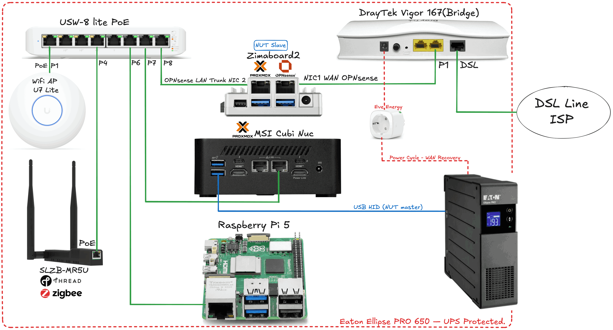
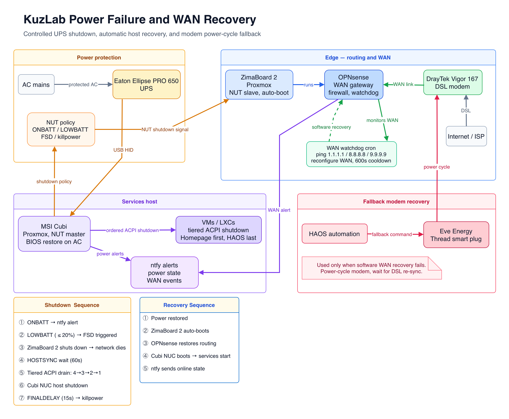
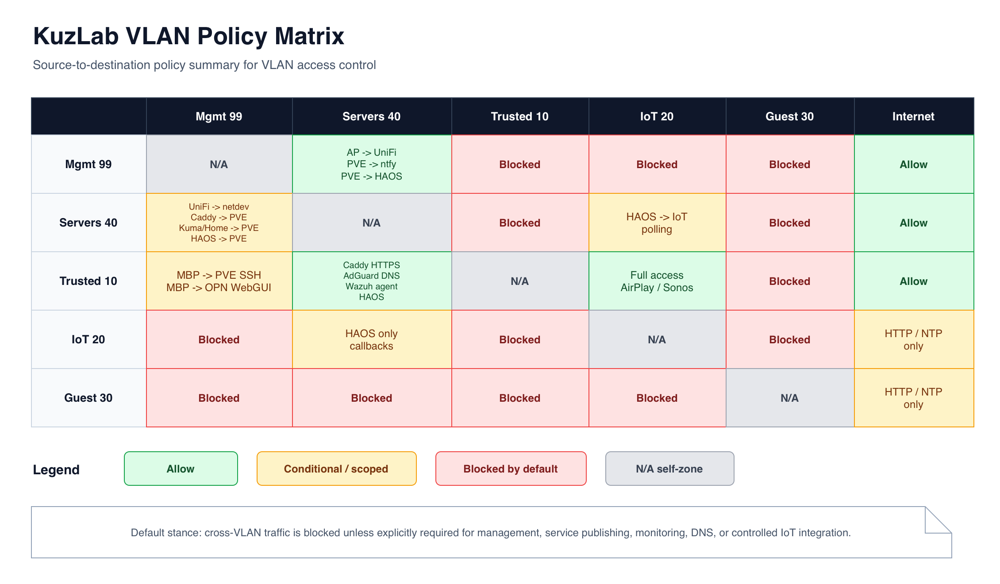
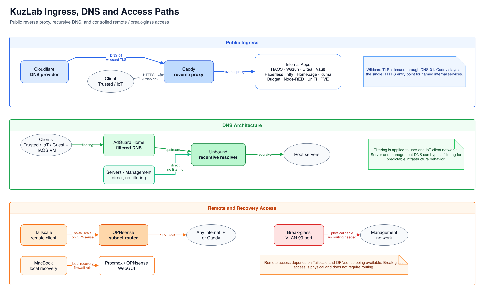
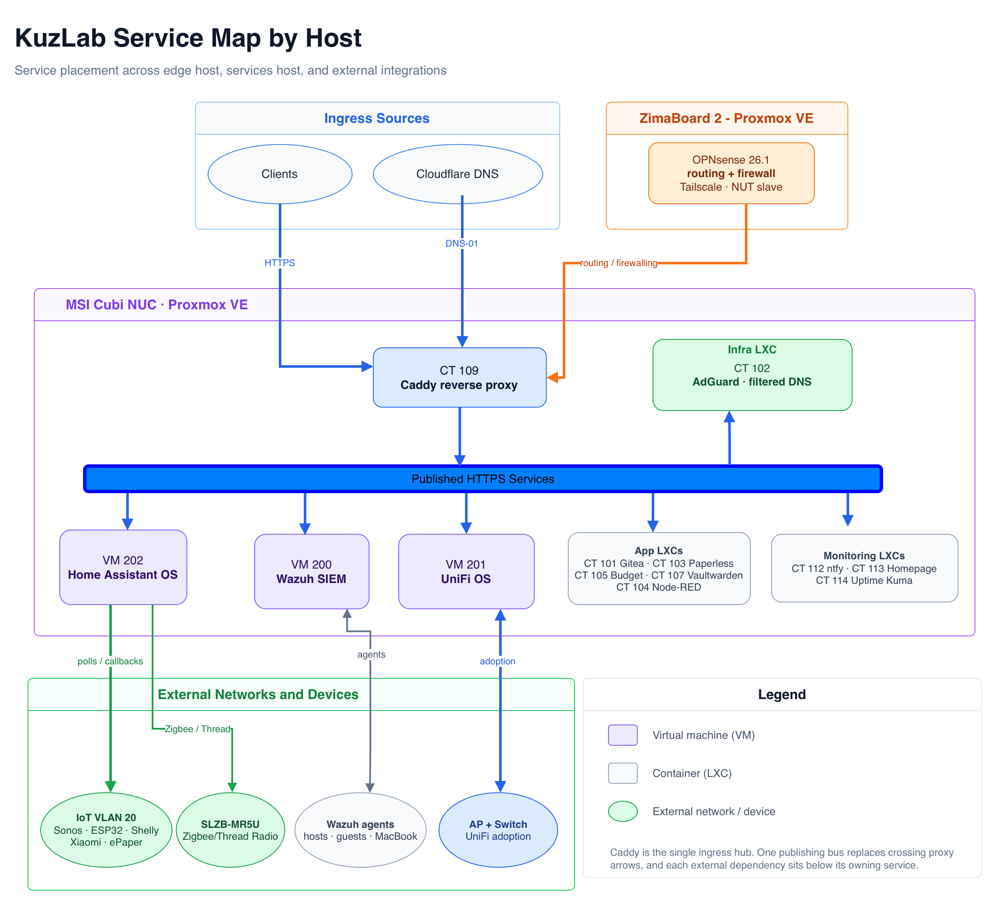

# kuzlab.dev — Home Infrastructure Lab

A self-hosted infrastructure environment built on Proxmox, OPNsense, and five-VLAN network segmentation — designed and operated as a real working lab for networking, security operations, and systems administration.

This homelab runs 24/7 and serves as my real daily-use environment, not just a test setup.

## Lab Journal

| Date | What changed |
|------|-------------|
| Jul 2026 | Migrated all 13 Docker services to Portainer Git-based stacks — compose files versioned in Gitea, one-click redeploy on push |
| Jul 2026 | Added service documentation for every container — volumes, env vars, operational notes |
| Jul 2026 | Node-RED adminAuth, Uptime Kuma monitors for 5 new services, backup tier audit |
| Jun 2026 | InfluxDB 2 → 3 Enterprise clean cutover, Grafana rebuilt on SQL datasources |
| Jun 2026 | Wazuh SIEM deployment — agents on all hosts, daily CVE digest via ntfy |
| May 2026 | Five-VLAN network segmentation, OPNsense moved to dedicated ZimaBoard |

---

> **At a glance:** Two Proxmox hosts · five VLANs · OPNsense firewall · 17 services · Wazuh SIEM · layered monitoring (Uptime Kuma · Beszel · Grafana/InfluxDB 3) · Portainer + Homarr · Caddy reverse proxy · Tailscale remote access · UPS with automated shutdown · off-site backups

> 📷 **[Physical setup and dashboard screenshots →](SETUP.md)**

Troubleshooting notes: [TROUBLESHOOTING.md](TROUBLESHOOTING.md)


[Architecture](#architecture) · [Network](#network-design) · [Services](#services) · [Security](#security-and-monitoring) · [Backups](#backups) · [Hardware](#hardware) · [Roadmap](#roadmap)

---

## Architecture

Traffic enters through a DrayTek Vigor 167 modem in bridge mode, passing raw PPPoE to OPNsense running as a VM on a dedicated ZimaBoard 2. OPNsense handles routing, firewalling, NAT, DHCP, and VLAN assignment.

OPNsense runs on its own host so that a failure on the main services machine doesn't take down the entire network. Before this split, everything lived on one NUC — a single point of failure for the whole stack.

Tailscale runs on OPNsense via the os-tailscale plugin, advertising all five VLANs. This means remote access keeps working even if the services host goes down — I can still reach OPNsense, diagnose the problem, and bring things back up.

A UniFi USW-Lite-8-PoE switch distributes tagged traffic across VLANs. A UniFi U7 Lite AP maps three SSIDs to Trusted, IoT, and Guest networks.

The MSI Cubi NUC runs all services on Proxmox VE as VMs and LXCs.



<details>
<summary>Switch port mapping</summary>

| Port | Device | Mode | PoE | Notes |
|------|--------|------|-----|-------|
| 1 | U7 Lite AP | Uplink | PoE+ | Servers native, tagged 10/20/30/99 |
| 2 | Empty | — | PoE+ | Reserved |
| 3 | Break-glass | Edge | — | VLAN 99 only, physical recovery access |
| 4 | SLZB-MR5U | Edge | PoE+ | Zigbee/Thread coordinator, VLAN 40 |
| 5 | Wired fallback | Edge | — | Trusted (10), laptop failsafe when WiFi is down |
| 6 | Reserved | — | — | Future Raspberry Pi 5 |
| 7 | MSI Cubi NUC | Uplink | — | Trunk: VLANs 10/40/99 |
| 8 | ZimaBoard 2 | Uplink | — | LAN trunk to OPNsense, all VLANs |

</details>

### Power and UPS

Everything is on an Eaton Ellipse PRO 650 UPS. Cubi is the NUT master, ZimaBoard is a network slave. On low battery, ZimaBoard shuts down first (takes the network with it), then Cubi drains all VMs in tiered order before the UPS cuts power. Recovery is fully automatic — tested end-to-end.

An Eve Energy smart plug on the DrayTek modem allows HAOS to power-cycle it automatically when the WAN watchdog detects a failure that software recovery can't fix.



[↑ top](#kuzlabdev--home-infrastructure-lab)

---

## Network Design

Inter-VLAN traffic is denied by default (RFC1918 block on every interface). All firewall rules use named aliases — no raw IPs anywhere. The idea is simple: nothing talks to anything unless there's an explicit rule for it, and every rule is readable without having to look up what address it points to.



### VLANs

| VLAN | ID | Subnet | Purpose |
|------|----|--------|---------|
| Management | 99 | 192.168.99.0/24 | Proxmox hosts, OPNsense, switch, AP |
| Servers | 40 | 192.168.40.0/24 | All VMs and containers |
| Trusted | 10 | 192.168.10.0/24 | Personal devices |
| IoT | 20 | 192.168.20.0/24 | Smart home devices |
| Guest | 30 | 192.168.30.0/24 | Guest WiFi — internet only |

### Firewall Policy

- **Trusted → Servers:** Caddy HTTPS, AdGuard DNS, Wazuh agent, HAOS
- **Trusted → IoT:** Full access for device admin, AirPlay, Sonos
- **Trusted → Management:** SSH and WebGUI to Proxmox/OPNsense (MacBook only, for recovery)
- **IoT → Servers:** Narrow callbacks to HAOS only (Sonos, Music Assistant, ESPHome)
- **Servers (HAOS) → IoT:** Device polling (ESPHome, miio, Shelly, Sonos)
- **Servers → Management:** UniFi controller, Caddy→Proxmox reverse proxy, monitoring, HAOS→Proxmox (Samba, NUT, sensors)
- **Management → Servers:** AP→UniFi controller, Proxmox→ntfy webhooks, Proxmox→HAOS CPU temp sensors
- **IoT → Trusted / Management:** Blocked
- **Guest → everything internal:** Blocked

Full ruleset: [firewall-rules.csv](OPNsense/firewall-rules.csv)

### DNS

```
Clients (Trusted / IoT / Guest) → AdGuard Home (filtering) → Unbound (recursive) → Root servers
Servers / Management            → Unbound (recursive) → Root servers
```

Servers bypass AdGuard on purpose — infrastructure DNS shouldn't depend on a filtering service. If AdGuard goes down, only client devices lose DNS; servers keep resolving.

No fallback DNS for clients — if AdGuard goes down, DNS fails visibly rather than silently bypassing filtering. That's intentional: I'd rather know it's broken than have unfiltered traffic I don't know about.

`*.kuzlab.dev` resolves via Cloudflare to Caddy, which handles TLS automatically through DNS-01 challenge.

### Access Model

Daily use goes through Caddy reverse proxy. Remote access uses Tailscale. Infrastructure management addresses are restricted — only the MacBook has direct firewall rules to reach Proxmox and OPNsense for local recovery. A dedicated VLAN 99 switch port provides physical break-glass access when routing is down.

| Scenario | Path |
|----------|------|
| Daily service access | Caddy via \*.kuzlab.dev |
| Remote access | Tailscale → Caddy or direct IP |
| Proxmox daily use | Caddy via cubi.kuzlab.dev / zima.kuzlab.dev |
| Local recovery | MacBook → direct Proxmox/OPNsense IP (firewall rule) |
| Emergency SSH | MacBook → Proxmox Cubi (bastion) |
| Break-glass | Cable to VLAN 99 switch port, static IP, no routing needed |

Each layer removes a dependency. Tailscale needs WAN, OPNsense, and the Tailscale service all working. The local firewall rule just needs OPNsense routing. The break-glass port only needs the switch to be powered — no routing, no software, just a cable.



[↑ top](#kuzlabdev--home-infrastructure-lab)

---

## Services



### Proxmox Guest Inventory

| ID | Name | Type | Role | IP |
|----|------|------|------|----|
| VM 202 | Home Assistant OS | VM | Home automation, dashboards | 192.168.40.10 |
| VM 200 | Wazuh | VM | SIEM — CVE detection, log collection (Ubuntu 24.04.4 LTS) | 192.168.40.19 |
| VM 201 | UniFi OS Server | VM | Network controller for AP and switch | 192.168.40.18 |
| CT 100 | Metrics (Grafana + InfluxDB 3) | LXC · Docker | Time-series metrics and dashboards | 192.168.40.23 |
| CT 101 | Gitea | LXC · native | Self-hosted Git | 192.168.40.14 |
| CT 102 | AdGuard Home | LXC · native | Network-wide DNS filtering | 192.168.40.11 |
| CT 103 | Paperless-ngx | LXC · Docker | Document management | 192.168.40.15 |
| CT 104 | Node-RED | LXC · Docker | Automation flows | 192.168.40.16 |
| CT 105 | Actual Budget | LXC · Docker | Personal finance tracking | 192.168.40.17 |
| CT 106 | Immich | LXC · Docker | Self-hosted photo and video backup | 192.168.40.24 |
| CT 107 | Vaultwarden | LXC · Docker | Password manager | 192.168.40.13 |
| CT 109 | Caddy | LXC · Docker | Reverse proxy (caddy-cloudflare) | 192.168.40.12 |
| CT 110 | Portainer | LXC · Docker | Container management + PeaNUT (UPS) + Beszel hub | 192.168.40.25 |
| CT 111 | Homarr | LXC · Docker | Operational dashboard | 192.168.40.26 |
| CT 112 | ntfy | LXC · native | Push notifications | 192.168.40.20 |
| CT 113 | Homepage | LXC · Docker | Dashboard (being phased out — replaced by Homarr) | 192.168.40.21 |
| CT 114 | Uptime Kuma | LXC · native | Uptime/reachability monitoring | 192.168.40.22 |

Docker-based LXCs each run their own Docker daemon behind a locked-down socket proxy, managed from Portainer. The rest (Gitea, AdGuard, ntfy, Uptime Kuma) are native community-script installs.

---

### Home Automation

Home Assistant OS (VM 202) runs dashboards and automations, with ESPHome-flashed devices (BLE proxies, an e-paper display) feeding it sensor data over the IoT VLAN.

More detail: [HomeAssistant.md](HomeAssistant.md)

[↑ top](#kuzlabdev--home-infrastructure-lab)

---

### Photos

Immich (CT 106) is my self-hosted replacement for cloud photo backup. It runs via Docker Compose using the official method, with the photo and video library bind-mounted from the Cubi SSD (`/mnt/pve/data1/immich`) rather than living inside the container. Accessible at `immich.kuzlab.dev`. The library is included in the offsite B2 sync, so photos follow the same 3-2-1 backup rule as everything else.

More detail: [Immich.md](Immich/Immich.md)

### Reverse Proxy

Caddy runs in Docker (using [`caddy-cloudflare`](https://github.com/caddy-builds/caddy-cloudflare)) and handles TLS for all `*.kuzlab.dev` subdomains via Cloudflare DNS-01.

More detail: [Caddy.md](Caddy/Caddy.md)

### Remote Access

Tailscale runs on OPNsense via the os-tailscale plugin with advertised routes for all VLANs. Full remote access without exposing anything to the public internet. Not required for local administration — daily use goes through Caddy, recovery uses direct firewall rules.

### Dashboards

Homarr (CT 111) is the main dashboard now. One page with live widgets for Proxmox, OPNsense, AdGuard, UniFi, Immich, Paperless, the UPS, and the monitoring tools. It talks to each service over the internal network, so the tiles show real data, not just links.

Homepage (CT 113) was the first dashboard and still runs. Homarr covers everything it did plus live container stats, so Homepage is on its way out — I just haven't pulled it yet because a few things (a Caddy admin-API firewall rule, some monitors) still point at it.

### Container Management

Each LXC runs its own Docker daemon, so no single socket sees everything. Portainer (CT 110) fixes that with an agent on every Docker LXC — one login to see and manage all of them.

All Docker services run as Portainer Git stacks linked to a private Gitea repo. Compose files are edited locally or via Gitea's web UI, pushed, and redeployed from Portainer with one click. Secrets stay in Portainer's environment variables — never in Git.

Nothing gets raw access to another container's Docker socket. Everything goes through a socket proxy (`linuxserver/socket-proxy`) locked down to start/stop/restart only — no create, no delete, read-only mount. So Homarr and Portainer can show stats and bounce a container, but can't do anything destructive through the socket.

The same LXC also runs PeaNUT, a small web UI for the UPS, and the Beszel hub for host monitoring.

[↑ top](#kuzlabdev--home-infrastructure-lab)

---

## Security and Monitoring

### Wazuh SIEM

Wazuh runs as a dedicated VM with agents on the Proxmox hosts, OPNsense, supported VMs and LXCs, and my MacBook. It scans for vulnerabilities, collects logs, and alerts on security events.

In practice, the main value is straightforward: when Wazuh flags a new CVE, that's my signal to schedule patching in the next maintenance window. I update the affected hosts, verify nothing broke, and move on. It's not a full SOC workflow — but it gives me real visibility into what needs attention and keeps the environment consistently patched.

Alerts go to ntfy via Dashboard Alerting monitors, and a daily digest summarizes CVE counts and noisy rules so I don't have to check the dashboard every day.

**A few real examples of how this has helped:**

- Wazuh flagged 120+ critical CVEs from an outdated kernel — resolved by upgrading to a supported HWE kernel.
- The UniFi controller's Debian 12 base had unfixable CVEs piling up. Rebuilt it on clean Debian 13, brought the count to near zero.
- Caught an OpenSSL vulnerability across multiple hosts. Patched and verified TLS was still working, no downtime.

### Metrics

A dedicated LXC (CT 100) runs Grafana and InfluxDB 3 Enterprise in Docker Compose. Home Assistant pushes ~55 entities into it — energy, climate, TRV valve positions, temperatures, weather, air quality, and infrastructure health — and both Proxmox hosts report in too. There are two databases, one for Home Assistant and one for Proxmox. Grafana reads them over SQL.

I actually started on InfluxDB 2.x and moved to 3 a few days later, while I only had about five days of data — so it was a clean cutover, no messy parallel run. The main trade-off: v3 dropped the built-in task engine for downsampling, so if I want long-term rollups later I'll need an external scheduler.

More detail: [Metrics.md](Metrics/Metrics.md)

### How the monitoring layers fit

I run a few monitoring tools and they each answer a different question, so they don't really overlap:

- **Uptime Kuma** (CT 114) — is it up? 17+ checks, all pinging ntfy when something drops.
- **Beszel** (hub on CT 110, agents on both Proxmox hosts) — host vitals: CPU, RAM, disk, temps, per-host Docker stats, with history.
- **Grafana + InfluxDB 3** (CT 100) — the deep history: energy and climate trends over weeks and months.
- **Wazuh** (VM 200) — the security layer: file integrity, CVE detection, agent health.
- **Homarr** (CT 111) — the single pane that pulls all of it together.

Beszel agents live on the Proxmox hosts themselves, not in an LXC, because they need to see the real hardware — actual CPU temperature instead of a value passed through Home Assistant.

### Firewall Rules

All OPNsense rules use named aliases — zero raw IPs. The ruleset is exported, auto-sorted by a Git pre-commit hook, and published as a CSV. Raw OPNsense exports are gitignored.

[↑ top](#kuzlabdev--home-infrastructure-lab)

---

## Backups

Backups follow a 3-2-1 approach for critical services: three copies, two media types, one offsite.

- **Local:** Proxmox vzdump to a dedicated SSD — three tiers based on how critical the data is (daily for things like Gitea and Vaultwarden, monthly for the Windows VM)
- **Offsite:** rclone sync to Backblaze B2, EU Central, ~$3/mo for ~380 GB
- **OPNsense:** Daily config backup via NFS from ZimaBoard to Cubi
- **Restore testing:** HAOS was restored to a new VMID as a drill — confirmed the backup chain works end-to-end

[↑ top](#kuzlabdev--home-infrastructure-lab)

---

## Hardware

| Device | Model | Role |
|--------|-------|------|
| Services host | MSI Cubi NUC (i5-120U, 40 GB DDR5, 1 TB NVMe + 1 TB SSD) | Proxmox VE — all VMs and LXCs |
| Firewall host | ZimaBoard 2 N150, 16 GB LPDDR5, 512 GB NVMe (2x i226-V 2.5 GbE) | Proxmox VE — dedicated OPNsense VM |
| Modem | DrayTek Vigor 167 | Bridge mode, raw WAN passthrough |
| Switch | UniFi USW-Lite-8-PoE | Managed, 8-port PoE, VLAN trunking |
| WiFi AP | UniFi U7 Lite | Wi-Fi 7, three SSIDs |
| UPS | Eaton Ellipse PRO 650 | Full stack power protection |
| Zigbee/Thread | SMLIGHT SLZB-MR5U | PoE coordinator, VLAN 40 |
| Rack | Waveshare HomeRack 8U, 10-inch | Switch, patch panel, modem, Cubi, PDU |
| Planned | Raspberry Pi 5 (8 GB) | PBS, secondary DNS, monitoring, Tailscale failover |

[↑ top](#kuzlabdev--home-infrastructure-lab)

---

## Software

- **Hypervisor:** Proxmox VE 9.x (both hosts)
- **Firewall:** OPNsense 26.1.x
- **Guest OS:** Debian 13, Ubuntu 24.04 (Wazuh)
- **Containers:** Docker Compose for service LXCs (Caddy, metrics, Immich, Paperless, and others), each behind a locked-down socket proxy
- **Metrics:** Grafana + InfluxDB 3 Enterprise
- **Monitoring:** Uptime Kuma (reachability), Beszel (host vitals)
- **Container management:** Portainer CE with Git-based stacks (Gitea) and an agent per Docker LXC
- **Dashboard:** Homarr
- **Provisioning:** Manual setup + [community scripts](https://community-scripts.github.io/ProxmoxVE/) for some containers

---

## Roadmap

- Finish Cisco NetAcad Network Technician
- CompTIA Security+ (SY0-701), Aug/Sep 2026
- Raspberry Pi 5 as a second node — Proxmox Backup Server, backup DNS, Tailscale failover, its own Uptime Kuma
- Homarr phase 2 — custom theme, embedded Grafana and Kuma panels, a few custom widgets
- Retire Homepage once everything points at Homarr
- Downsampling for InfluxDB 3 — needs an external scheduler since v3 dropped the built-in task engine
- Update automation — Diun for image update notices, unattended-upgrades for OS patches
- Stirling-PDF, and a DIY Siedle intercom over ESP32/ESPHome

---

## About

This lab is part of a career transition into IT. I'm a Polish citizen based in Germany. Languages: Russian (native), Polish (C1), English (professional), German (basic).

Everything here is built from scratch over the past year. It's both my daily-use environment and a learning platform.


- **LinkedIn:** [kuzin-viacheslav](https://linkedin.com/in/kuzin-viacheslav)
