# Setup and Screenshots

Physical hardware, workspace, and the dashboards that run on top of it.

---

## Rack

Waveshare HomeRack 8U, 10-inch. Everything fits in one unit — modem, patch panel, switch, NUC, and space reserved for a Raspberry Pi 5. The Eaton UPS sits beside it.

### Front

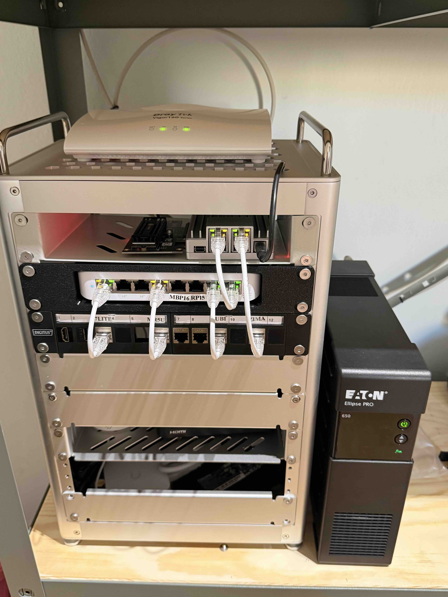

From top to bottom: DrayTek Vigor 167 modem, ZimaBoard 2, USW-Lite-8-PoE with patch panel, MSI Cubi NUC, empty shelf for the future RPi 5. Patch panel ports are labeled — makes troubleshooting faster when you can just look at the front and see which cable goes where.

### Back

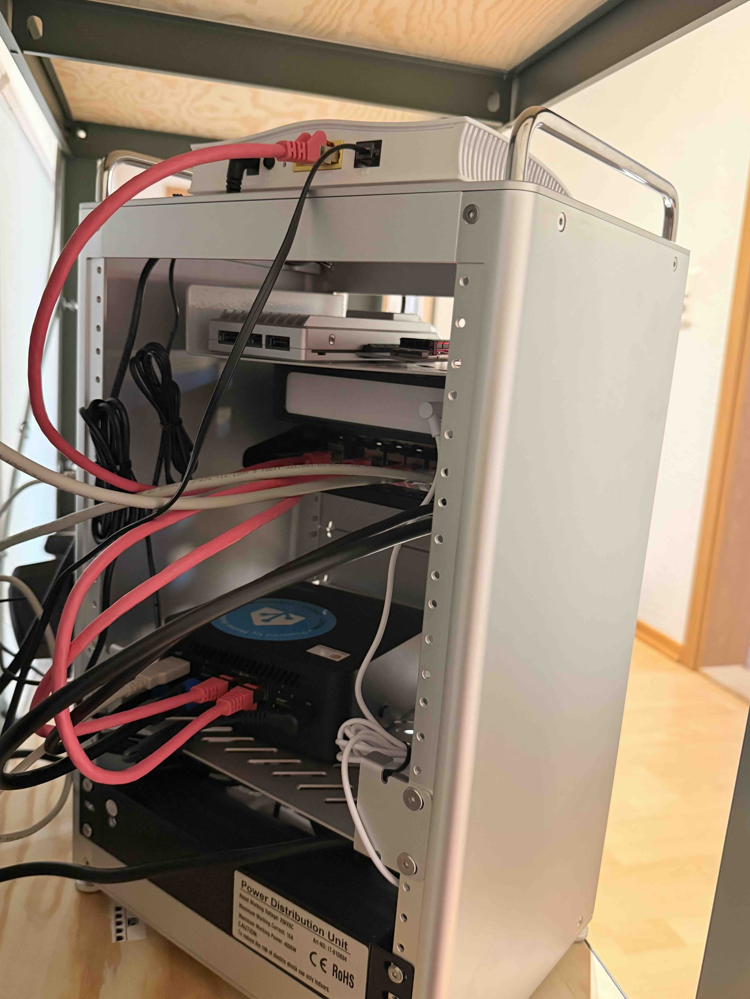

PDU mounted at the bottom rear. Cable management is a work in progress.

---

## Workspace

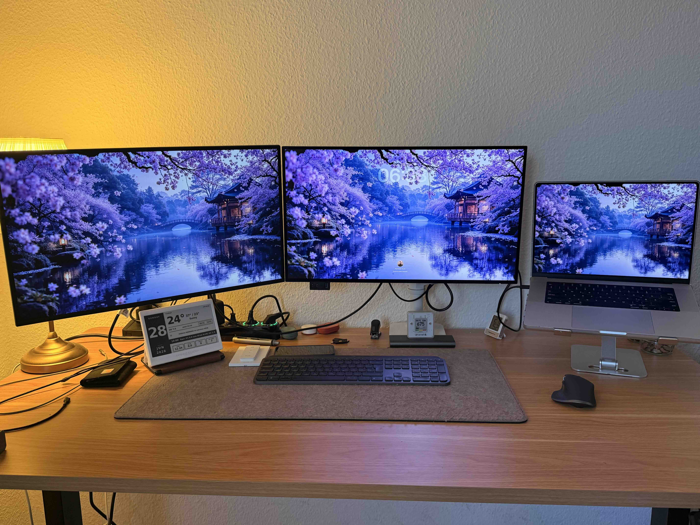

Dell UltraSharp U2725QE (center) + Philips 27E1N1600AM (left) + MacBook Pro 16 M1 Pro on a stand. The ePaper display on the left shows date, weather, and outdoor conditions — updated three times a day via ESPHome. The small screen on the right is an Aranet4 CO2 monitor.

Keyboard is a Logitech MX Keys S, mouse is an MX Master 3S, both on Logi Bolt.

---

## Dashboards

### Homarr

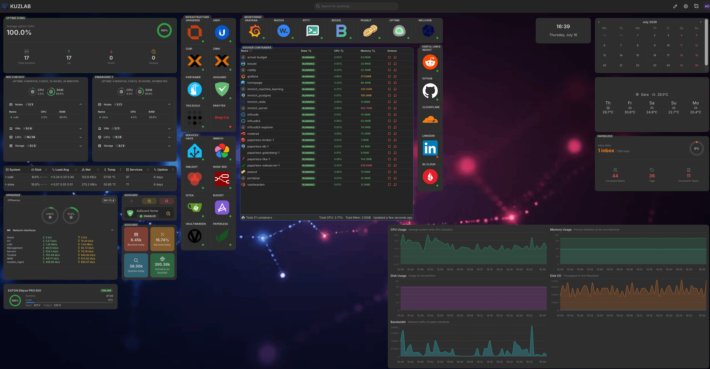

The main dashboard now. One page pulling live data from everything: uptime status, both Proxmox hosts (CPU, RAM, VMs, LXCs), all 21 Docker containers, OPNsense traffic, AdGuard blocking, and the UPS — plus quick tiles and widgets for each service, a calendar, and the weather. This is what I actually open day to day.

### Homepage

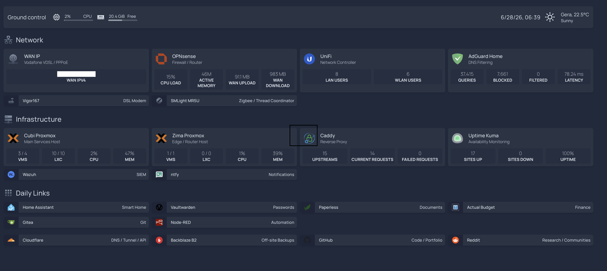

My first dashboard, still running. Top section shows WAN status, OPNsense stats, UniFi clients, and AdGuard filtering numbers. Infrastructure row shows both Proxmox hosts, Caddy upstreams, and Uptime Kuma status. Bottom section has quick links to all services.

Homarr now covers all of this with live widgets on top, so Homepage will probably get retired in full once the last few things (a Caddy firewall rule, some monitors) stop pointing at it.

### Grafana

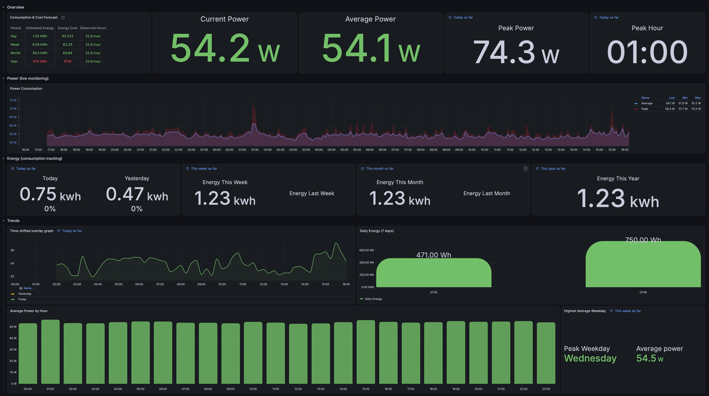

Grafana sitting on top of InfluxDB 3, here showing the homelab's power use — current draw, peak hour, energy per day/week/month, and average power by hour. Home Assistant and both Proxmox hosts feed the data.

### Portainer

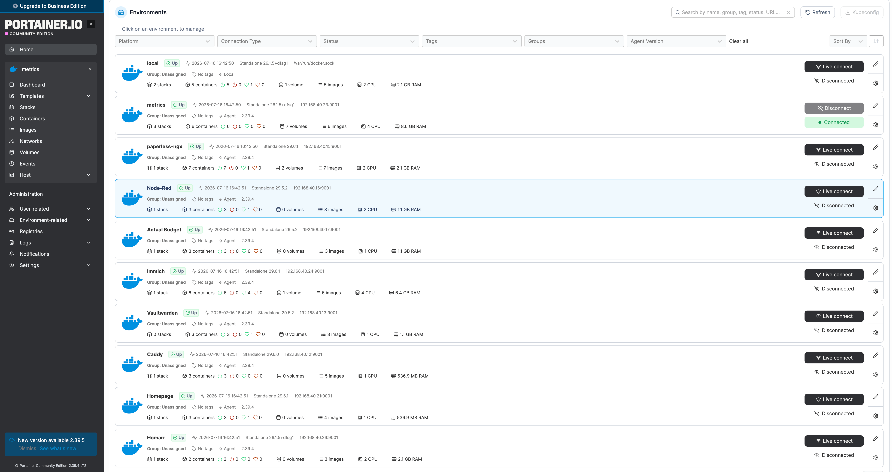

Portainer with an agent on each Docker LXC, so every container across all of them shows up in one place — metrics, Immich, Paperless, Caddy, Homepage, Homarr, and the rest. I can start, stop, or check any of them without SSHing into nine separate containers.

### Proxmox — Cubi (services host)

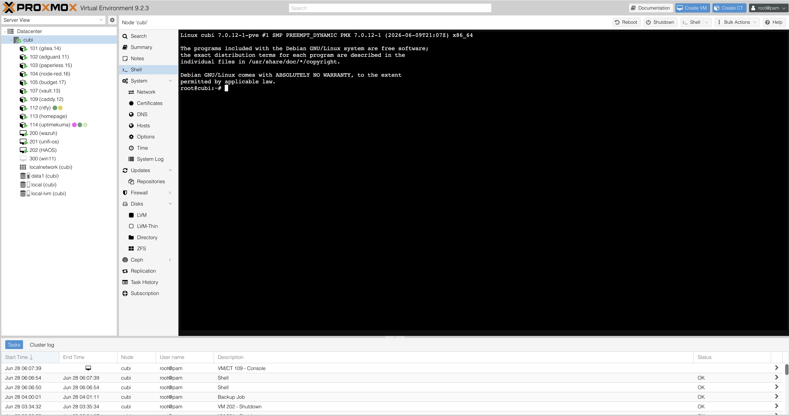

The main services host. All the LXCs and VMs visible in the sidebar. Task log at the bottom shows recent backup jobs and console sessions.

### Proxmox — ZimaBoard (edge host)

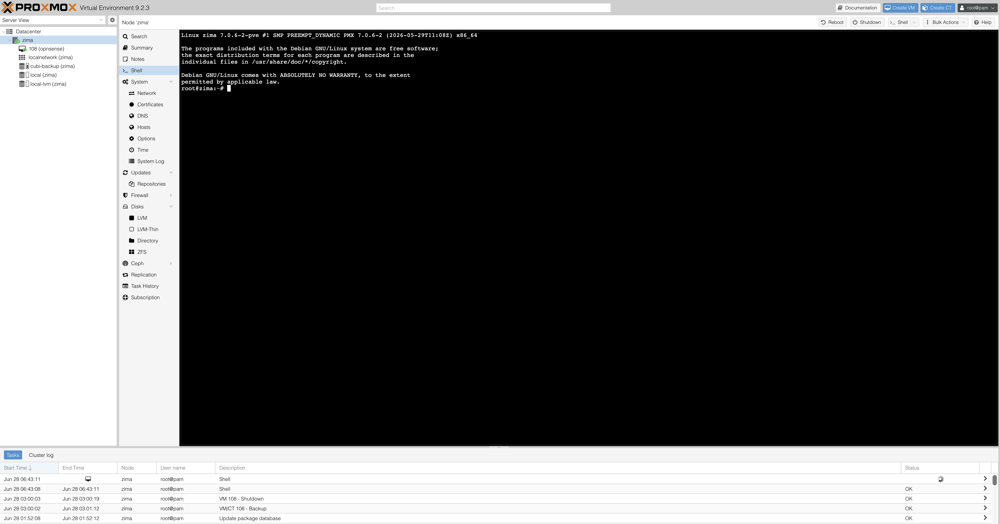

The dedicated firewall host. Only one VM — OPNsense. Task log shows the nightly OPNsense backup and scheduled shutdown/startup cycles.

### Home Assistant

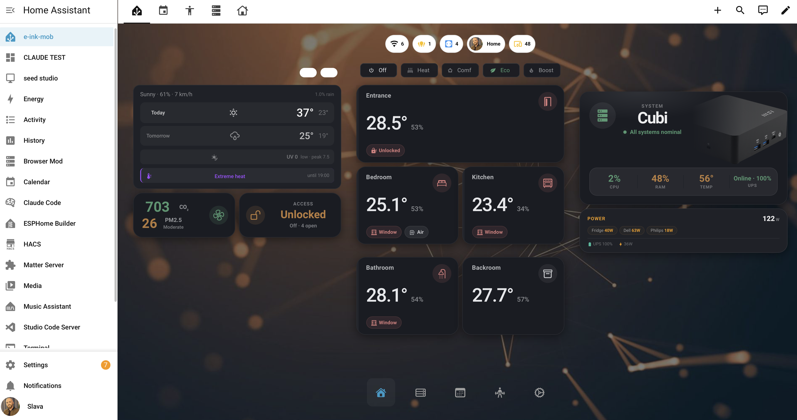

Home Assistant dashboard showing both Proxmox hosts (Cubi and ZimaBoard) with CPU, RAM, storage, and temperature monitoring. All VMs and containers are visible with resource usage. UPS status, UniFi AP with connected clients, and OPNsense health are tracked from one place.

### OPNsense

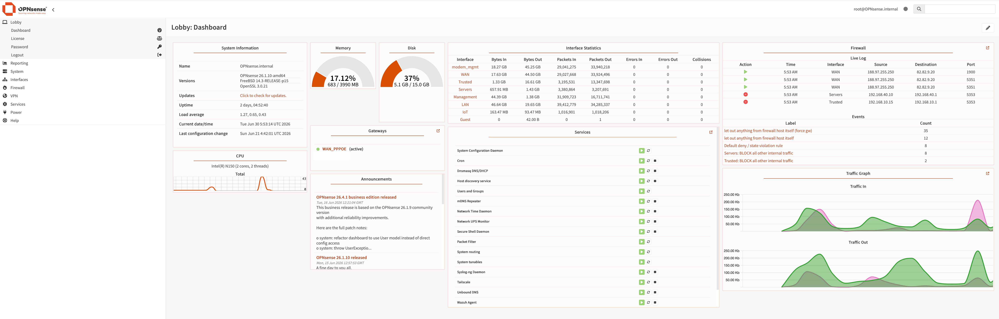

OPNsense dashboard — interfaces, traffic graphs, firewall log, and running services.

### Uptime Kuma

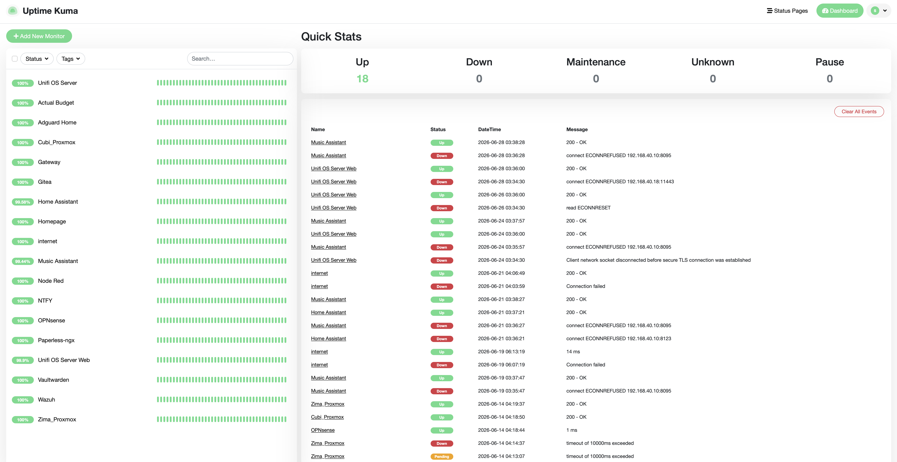

18 monitors covering gateways, core services, and internet connectivity. The event log shows real incidents — brief Music Assistant and UniFi restarts during maintenance, and the occasional internet drop that the WAN watchdog catches.

### AdGuard Home

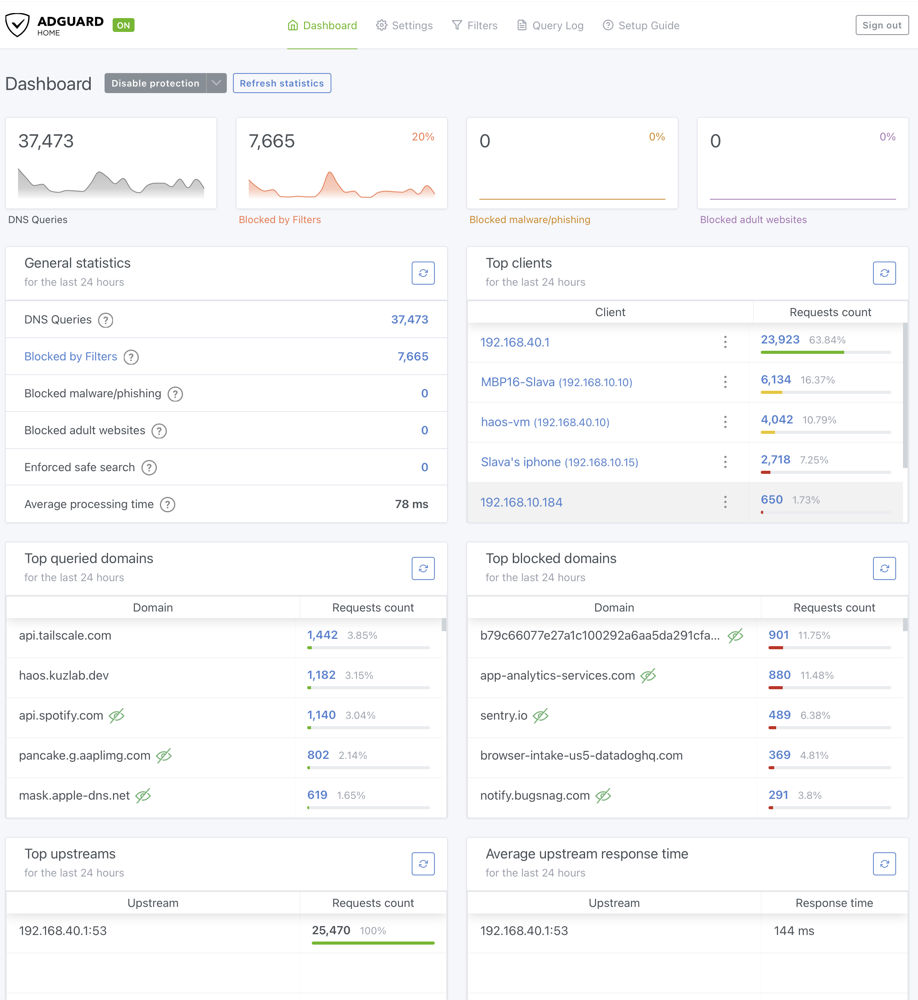

~37k queries in 24 hours, 20% blocked. Upstream goes to Unbound at 192.168.40.1 (OPNsense) for recursive resolution. Top clients are the MacBook, HAOS, and iPhone — servers bypass AdGuard and resolve directly through Unbound.

### UniFi Network

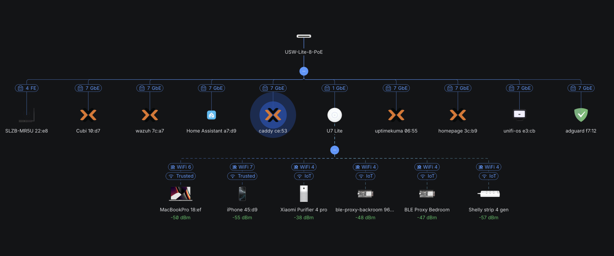

Live network topology from UniFi OS. Shows the USW-Lite-8-PoE switch with all connected devices, the U7 Lite AP, and wireless clients with their VLAN assignments (Trusted vs IoT). SLZB-MR5U coordinator visible on the far left at 4 FE (Fast Ethernet over PoE).
